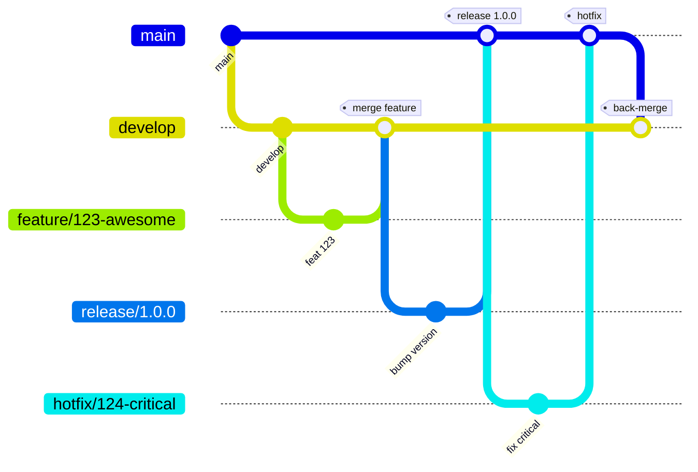

## Development

> **Scope:** The practices in this section were agreed by the team during **Sprint 5 (26 May – 30 June 2025)** and are effective for all future work unless superseded.

### Kanban boards

Our team uses two GitHub Projects boards. Column descriptions inside each board have been updated to match the entry criteria below so they are always visible in the UI. The same criteria are version‑controlled here for traceability.

#### Sprint Board *(Projects / Board 1)*

[https://github.com/orgs/inno-swp-2025/projects/1](https://github.com/orgs/inno-swp-2025/projects/1)

| Column              | Entry criteria – all items must be true before a card is moved here                                                                                    |
| ------------------- | ------------------------------------------------------------------------------------------------------------------------------------------------------ |
| **To Do**           | • Issue created from the template <br> • Acceptance criteria written <br> • Size estimate (story points) <br> • Priority label assigned                            |
| **In Progress**     | • All *To Do* criteria <br> • A branch named `<type>/<issue‑id>-<slug>` created from `develop` and linked <br> • Assignee set <br> • Draft MR opened               |
| **In Review**       | • All *In Progress* criteria <br> • CI pipeline green <br> • MR description complete and linked to the issue <br> • Reviewer(s) assigned                           |
| **Ready to deploy** | • MR approved by ≥ 1 reviewer <br> • QA checklist ticked <br> • MR squash‑merged into `develop`                                                                |
| **User Testing**    | • Change included in the nightly staging deployment <br> • Smoke tests passed <br> • Hand‑over note to PO/UX posted                                            |
| **Done**            | • User/PO feedback positive or no blocking feedback after 24 h <br> • Change merged into `main` via release/hotfix branch <br> • Issue closed (keywords in PR) |

#### Product Backlog Board *(Projects / Board 2)*

[https://github.com/orgs/inno-swp-2025/projects/2](https://github.com/orgs/inno-swp-2025/projects/2)

| Column                    | Entry criteria                                    |
| ------------------------- | ------------------------------------------------- |
| **Icebox**                | Raw idea captured                                 |
| **Needs triage**          | Idea validated by PO, minimal description present |
| **Backlog**               | Acceptance criteria drafted, estimate ≤ 8 SP      |
| **Next Sprint Candidate** | Priority confirmed, dependencies identified       |
| **Moved to Sprint**       | Pulled into Sprint board **To Do**                |

### Git workflow

We follow **Gitflow** (Vincent Driessen) with lightweight adaptations for GitHub.



#### Issue management

* **Templates** – Issues must be created from the relevant `.github/ISSUE_TEMPLATE`.
* **Labels** – At least one *type* (`feature`, `bug`, `tech‑debt`, `docs`) **and** one *priority* (`P0`–`P3`).
* **Assignees** – Self‑assign (solo) or assign all contributors (pair/ensemble).

#### Branching strategy

| Branch type | Pattern                     | Base    | Purpose                      |
| ----------- | --------------------------- | ------- | ---------------------------- |
| Main        | `main`                      | –       | Production‑ready code        |
| Develop     | `develop`                   | main    | Integration of approved work |
| Feature     | `feature/<issue‑id>-<slug>` | develop | New functionality            |
| Bugfix      | `bugfix/<issue‑id>-<slug>`  | develop | Non‑urgent defect fix        |
| Hotfix      | `hotfix/<issue‑id>-<slug>`  | main    | Urgent production fix        |
| Release     | `release/<version>`         | develop | Stabilise for deployment     |

#### Commit messages

We adhere to **Conventional Commits**:

```
<type>(<scope>): <short summary>

<body>

<footer>
```

*Types*: `feat`, `fix`, `docs`, `style`, `refactor`, `perf`, `test`, `build`, `ci`, `chore`, `revert`.

#### Pull Requests

1. Draft PR opened at the start of work – populated by `.github/PULL_REQUEST_TEMPLATE.md`.
2. CI (lint, unit/integration tests, SCA) must pass.
3. ≥ 1 approval (≥ 2 for hotfix or release branches).
4. PRs are **squash‑merged**; the default target is `develop` (or `main` for hotfix).
5. Use GitHub keywords (e.g. `Closes #123`) to auto‑close the issue.

#### Code reviews

* At least one reviewer who is not the author.
* Focus: correctness, readability, tests, security, performance.
* Small PRs (≤ 400 LoC) are expected; larger PRs require prior team OK.

#### Resolving issues

Issues transition automatically when the linked PR is merged; manual adjustments are allowed only to correct mistakes.

### Secrets management

| Aspect          | Practice                                                                           |
| --------------- | ---------------------------------------------------------------------------------- |
| **Encryption**  | All secret files use [SOPS](https://github.com/getsops/sops) with `age` keys       |
| **Key storage** | 1Password *DevOps* vault (access: DevOps leads)                                    |
| **Repository**  | Encrypted YAML files in `config/secrets/`, e.g. `production.yaml.enc`              |
| **CI/CD**       | Secrets injected via GitHub Actions *Repository* or *Environment* secrets          |
| **Runtime**     | Application reads configuration exclusively from environment variables (12‑Factor) |
| **Local dev**   | `.env.local.enc` decrypted on demand via `make secrets:decrypt`                    |

> **Never** paste secrets into code, commit history, pull requests, or chat tools. If you need a new secret, add it encrypted to the `secrets` folder and open a PR.
