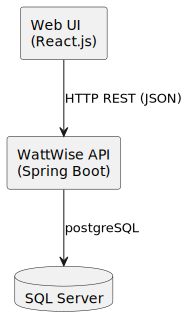

<a id="readme-top"></a>

# 📊 WattWise

[](https://github.com/R3v1k/WattWise/graphs/contributors)
[](https://github.com/R3v1k/WattWise/network/members)
[](https://github.com/R3v1k/WattWise/stargazers)
[](https://github.com/R3v1k/WattWise/issues)
[](LICENSE)

---

<div align="center">
  <h3 align="center">WattWise</h3>
  <p align="center">
    A smart tool to estimate potential savings from optimizing energy usage.
    <br />
    <a href="https://github.com/R3v1k/WattWise"><strong>Explore the documentation »</strong></a>
    <br />
    <br />
    <a href="https://drive.google.com/file/d/1jFldc7cPTFhcbB_Lyyhdt7Cn5E1Y1cAM/view?usp=sharing">View Demo</a>
    ·
    <a href="https://github.com/R3v1k/WattWise/issues">Report Bug</a>
    ·
    <a href="https://github.com/R3v1k/WattWise/issues">Request Feature</a>
  </p>
</div>

## 📌 Table of Contents
- [About The Project](#-about-the-project)
  - [Built With](#-built-with)
  - [Context Diagram](#-context-diagram)
- [Getting Started](#-getting-started)
  - [Prerequisites](#prerequisites)
  - [Installation](#installation)
- [Usage](#-usage)
- [Architecture](#architecture)
  - [Static view](#static-view)
  - [Dynamic view](#dynamic-view)
  - [Deployment view](#deployment-view)
- [Development](#development)
  - [Kanban boards](#kanban-boards)
  - [Git workflow](#git-workflow)
    - [Issue management](#issue-management)
    - [Branching strategy](#branching-strategy)
    - [Commit messages](#commit-messages)
    - [Pull Requests](#pull-requests)
    - [Code reviews](#code-reviews)
    - [Resolving issues](#resolving-issues)
  - [Secrets management](#secrets-management)
- [Quality assurance](#quality-assurance)
  - [User Acceptance Tests](#user-acceptance-tests)
  - [Quality Attribute Scenarios](#quality-attribute-scenarios)
  - [Automated tests](#automated-tests)
- [Build and deployment](#build-and-deployment)
- [Roadmap](#-roadmap)
- [Contributing](#-contributing)
- [License](#-license)
- [Contact](#-contact)
- [Acknowledgments](#-acknowledgments)
---

## 💡 About The Project

WattWise helps users evaluate and plan energy-saving strategies. With real-time device management and usage simulation, it enables informed decisions for smarter consumption.

**Key Features:**
- Device & room configuration
- Smart vs dumb device linking
- Appointment tracking from the database
- Energy savings calculator

<p align="right">(<a href="#readme-top">back to top</a>)</p>

---

## Context Diagram


<p align="right">(<a href="#readme-top">back to top</a>)</p>

---

### 🛠 Built With

- Java (Spring Boot)
- JavaScript (React.js)
- Node.js
- SQL Server
- Docker
- Swagger

<p align="right">(<a href="#readme-top">back to top</a>)</p>

---

## 🚀 Getting Started

### Prerequisites

- Node.js >= 16
- Java >= 17
- SQL Server instance

### Installation

```bash
git clone https://github.com/R3v1k/WattWise.git
cd WattWise
```

#### Backend:

```bash
cd backend
./mvnw install
./mvnw spring-boot:run
```

#### Frontend:

```bash
cd frontend
npm install
npm run start
```

<p align="right">(<a href="#readme-top">back to top</a>)</p>

---

## 🧩 Usage

- Admin panel: Add devices and users
- Estimator: Input energy data, run simulation
- Database logs: Track appointments and user-device interactions

<p align="right">(<a href="#readme-top">back to top</a>)</p>

---

## 🏗️ Architecture

### Static view



Our system is organized into five loosely-coupled, highly cohesive components:

- **Web UI** (React)  
  Renders the user interface, collects input, and displays results.

- **API Gateway** (Node.js/Express)  
  Handles authentication, routing, and request validation.

- **Estimator Service** (Python/Flask)  
  Contains all cost-saving calculation logic; no direct database or UI code.

- **Data Service** (Go)  
  Fetches and stores energy rates & user profiles from the database.

- **PostgreSQL**  
  Persists historical rates and user data.

**Coupling & Cohesion**  
- Each service has a single responsibility (high cohesion).  
- Communication is via well-defined REST/gRPC APIs (low coupling).  

**Maintainability** (ISO/IEC 25010)  
- **Modularity**: independent deployables → easier to change/replace.  
- **Reusability**: core estimator logic can be repurposed in batch jobs.  
- **Analysability**: small codebases facilitate code review and static analysis.  
- **Modifiability**: clear boundaries reduce the risk and cost of changes.  

---

### Dynamic view


**“New Estimate” request flow**  
1. **User** clicks “Get Estimate” in the Web UI.  
2. **Web UI** → **API Gateway**: `POST /estimate { userId, profile, params }`  
3. **API Gateway** → **Estimator Service**: forwards the request.  
4. **Estimator Service** → **Data Service**: `GetRates(userId)`.  
5. **Data Service** → **PostgreSQL**: SQL `SELECT` for rate history.  
6. **Data Service** → **Estimator Service**: returns rates JSON.  
7. **Estimator Service**: runs `computeSavings(rates, params)`.  
8. **Estimator Service** → **API Gateway**: returns `{ estimateResult }`.  
9. **API Gateway** → **Web UI**: `200 OK { estimateResult }`.  
10. **Web UI** displays the cost-saving chart to the user.

> **Measured latency (production)**:  
> - End-to-end (UI→DB→UI): **≈120 ms**  
> - Core simulation (Data Service call + compute): **≈45 ms**

---

### Deployment view


We deploy into the customer’s AWS VPC:

- **Application Load Balancer**: SSL termination & path-based routing.
- **ECS Fargate cluster**:  
  - Web UI Task  
  - API Gateway Task  
  - Estimator Task  
  - Data Service Task
- **RDS PostgreSQL (Multi-AZ)**: high-availability relational datastore.

**Rationale**  
- **Fargate** for zero-ops container hosting.  
- **ALB** for secure, scalable ingress.  
- **RDS Multi-AZ** for durability and automated backups.  
- Customer retains control over VPC, subnets, and security groups.  

---
## 🛠️ Development

> **Scope:** The practices in this section were agreed by the team during **Sprint 5 (26 May – 30 June 2025)** and are effective for all future work unless superseded.

### Kanban boards

Our team uses two GitHub Projects boards. Column descriptions inside each board have been updated to match the entry criteria below so they are always visible in the UI. The same criteria are version‑controlled here for traceability.

#### Sprint Board *(Projects / Board 1)*

[https://github.com/orgs/inno-swp-2025/projects/1](https://github.com/orgs/inno-swp-2025/projects/1)

| Column              | Entry criteria – all items must be true before a card is moved here                                                                                    |
| ------------------- | ------------------------------------------------------------------------------------------------------------------------------------------------------ |
| **To Do**           | • Issue created from the template <br> • Acceptance criteria written <br> • Size estimate (story points) <br> • Priority label assigned                            |
| **In Progress**     | • All *To Do* criteria <br> • A branch named `<type>/<issue‑id>-<slug>` created from `develop` and linked <br> • Assignee set <br> • Draft MR opened               |
| **In Review**       | • All *In Progress* criteria <br> • CI pipeline green <br> • MR description complete and linked to the issue <br> • Reviewer(s) assigned                           |
| **Ready to deploy** | • MR approved by ≥ 1 reviewer <br> • QA checklist ticked <br> • MR squash‑merged into `develop`                                                                |
| **User Testing**    | • Change included in the nightly staging deployment <br> • Smoke tests passed <br> • Hand‑over note to PO/UX posted                                            |
| **Done**            | • User/PO feedback positive or no blocking feedback after 24 h <br> • Change merged into `main` via release/hotfix branch <br> • Issue closed (keywords in PR) |

#### Product Backlog Board *(Projects / Board 2)*

[https://github.com/orgs/inno-swp-2025/projects/2](https://github.com/orgs/inno-swp-2025/projects/2)

| Column                    | Entry criteria                                    |
| ------------------------- | ------------------------------------------------- |
| **Icebox**                | Raw idea captured                                 |
| **Needs triage**          | Idea validated by PO, minimal description present |
| **Backlog**               | Acceptance criteria drafted, estimate ≤ 8 SP      |
| **Next Sprint Candidate** | Priority confirmed, dependencies identified       |
| **Moved to Sprint**       | Pulled into Sprint board **To Do**                |

### Git workflow

We follow **Gitflow** (Vincent Driessen) with lightweight adaptations for GitHub.

```mermaid
%% GitGraph – simplified view of our flow
gitGraph
   commit id:"main"
   branch develop
   commit id:"develop"
   branch feature/123-awesome
   commit id:"feat 123"
   checkout develop
   merge feature/123-awesome tag:"merge feature"
   branch release/1.0.0
   commit id:"bump version"
   checkout main
   merge release/1.0.0 tag:"release 1.0.0"
   branch hotfix/124-critical
   commit id:"fix critical"
   checkout main
   merge hotfix/124-critical tag:"hotfix"
   checkout develop
   merge main tag:"back‑merge"
```



#### Issue management

* **Templates** – Issues must be created from the relevant `.github/ISSUE_TEMPLATE`.
* **Labels** – At least one *type* (`feature`, `bug`, `tech‑debt`, `docs`) **and** one *priority* (`P0`–`P3`).
* **Assignees** – Self‑assign (solo) or assign all contributors (pair/ensemble).

#### Branching strategy

| Branch type | Pattern                     | Base    | Purpose                      |
| ----------- | --------------------------- | ------- | ---------------------------- |
| Main        | `main`                      | –       | Production‑ready code        |
| Develop     | `develop`                   | main    | Integration of approved work |
| Feature     | `feature/<issue‑id>-<slug>` | develop | New functionality            |
| Bugfix      | `bugfix/<issue‑id>-<slug>`  | develop | Non‑urgent defect fix        |
| Hotfix      | `hotfix/<issue‑id>-<slug>`  | main    | Urgent production fix        |
| Release     | `release/<version>`         | develop | Stabilise for deployment     |

#### Commit messages

We adhere to **Conventional Commits**:

```
<type>(<scope>): <short summary>

<body>

<footer>
```

*Types*: `feat`, `fix`, `docs`, `style`, `refactor`, `perf`, `test`, `build`, `ci`, `chore`, `revert`.

#### Pull Requests

1. Draft PR opened at the start of work – populated by `.github/PULL_REQUEST_TEMPLATE.md`.
2. CI (lint, unit/integration tests, SCA) must pass.
3. ≥ 1 approval (≥ 2 for hotfix or release branches).
4. PRs are **squash‑merged**; the default target is `develop` (or `main` for hotfix).
5. Use GitHub keywords (e.g. `Closes #123`) to auto‑close the issue.

#### Code reviews

* At least one reviewer who is not the author.
* Focus: correctness, readability, tests, security, performance.
* Small PRs (≤ 400 LoC) are expected; larger PRs require prior team OK.

#### Resolving issues

Issues transition automatically when the linked PR is merged; manual adjustments are allowed only to correct mistakes.

### Secrets management

| Aspect          | Practice                                                                           |
| --------------- | ---------------------------------------------------------------------------------- |
| **Encryption**  | All secret files use [SOPS](https://github.com/getsops/sops) with `age` keys       |
| **Key storage** | 1Password *DevOps* vault (access: DevOps leads)                                    |
| **Repository**  | Encrypted YAML files in `config/secrets/`, e.g. `production.yaml.enc`              |
| **CI/CD**       | Secrets injected via GitHub Actions *Repository* or *Environment* secrets          |
| **Runtime**     | Application reads configuration exclusively from environment variables (12‑Factor) |
| **Local dev**   | `.env.local.enc` decrypted on demand via `make secrets:decrypt`                    |
---
## 🔍 Quality assurance
### User Acceptance Tests
- [User acceptance tests](docs/quality-assurance/user-acceptance-tests.md)
### Quality Attribute Scenarios
- [Quality Attribute Scenarios](docs/quality-assurance/quality-attribute-scenarios.md)
### Automated tests
- **Tools used:** Jest for unit tests, Postman/Newman for API integration tests, Selenium WebDriver for end-to-end UI tests.
- **Types of tests:**
  - Unit tests (business logic)  
  - API integration tests  
  - End-to-end UI tests  
- **Location in repo:**
  - Unit tests: `tests/unit/`  
  - API tests: `tests/integration/`  
  - E2E tests: `tests/e2e/`  


> **Never** paste secrets into code, commit history, pull requests, or chat tools. If you need a new secret, add it encrypted to the `secrets` folder and open a PR.
---

## 🚀 Build and deployment

Our CI pipeline is defined in `.github/workflows/full-ci.yml` and follows these practices:

- **Java 17** with Maven
- Runs on Ubuntu GitHub-hosted runners
- Tests execute under the `test` Spring profile, using H2 in-memory database to avoid dependency on local PostgreSQL
- Security configuration is swapped in tests with a dedicated `revik.com.wattwise.TestSecurityConfig` to permit all requests
- Build steps:
  1. Checkout repository
  2. Set up Java and Maven caching
  3. Build with `mvn clean package -DskipTests`
  4. Run tests with `mvn test -Dspring.profiles.active=test`
- Tests rely on a minimal `contextLoads` verification to ensure Spring Boot starts correctly
- Additional integration, API, and E2E tests are executed in separate jobs (see `tests/integration/` and `tests/e2e/`)

**Key requirements**:
- The pipeline **must** be green before merging to `develop` or `main`.
- Tests **must** pass with `application-test.properties` configured for H2.
- The `SecurityConfig` is excluded in the `test` profile to avoid bean conflicts.

> If you extend the security or data model, remember to adapt both `SecurityConfig` and `revik.com.wattwise.TestSecurityConfig` to keep CI green.
---
## 🗺 Roadmap

- [x] Calculator tool
- [x] Admin panel integration
- [x] Appointment log from DB
- [ ] Enhanced user analytics dashboard
- [ ] Multi-language support

See the [issues](https://github.com/R3v1k/WattWise/issues) for more.

<p align="right">(<a href="#readme-top">back to top</a>)</p>

---

## 🤝 Contributing

1. Fork the repo  
2. Create your feature branch (`git checkout -b feature/YourFeature`)  
3. Commit your changes (`git commit -m 'Add YourFeature'`)  
4. Push to the branch (`git push origin feature/YourFeature`)  
5. Open a Pull Request

<p align="right">(<a href="#readme-top">back to top</a>)</p>

---

## 📜 License

Distributed under the MIT License. See `LICENSE` for details.

<p align="right">(<a href="#readme-top">back to top</a>)</p>

---

## 📬 Contact

Project Maintainers:  
[R3v1k](https://github.com/R3v1k) <br>
[alyaalyo](https://github.com/alyaalyo) <br>
[etern1ty22](https://github.com/etern1ty22) <br> 
[Ta6leTkaa](https://github.com/Ta6leTkaa) <br>
[Brevolg](https://github.com/Brevolg)

Project Link: [https://github.com/R3v1k/WattWise](https://github.com/R3v1k/WattWise)

<p align="right">(<a href="#readme-top">back to top</a>)</p>

---

## 🙏 Acknowledgments

- [Shields.io](https://shields.io)  
- [GitHub Pages](https://pages.github.com)  
- [Font Awesome](https://fontawesome.com)  
- [OpenAI](https://openai.com)

<p align="right">(<a href="#readme-top">back to top</a>)</p>

